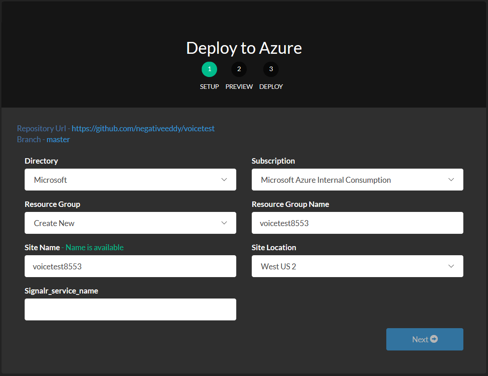

# Deploying Azure Resources 
This project provides you with the scripts needed to deploy the necessary resources for a Microsoft Speech Studio demo. 

## Things you need first 
1. An [Azure](https://azure.microsoft.com/) subscription. 
2. PowerShell

## Deploying Azure Resources
1. Click the botton blow:<br/>[](https://azuredeploy.net/)<br> 

2. A new window should pop up that prompts you to log into your Azure account. 

3. Once logged in your should be greeted with the below screen:


4. Make sure the correct "Directory" and "Subscription" are selected.

5. Next, you are able to edit the name of "Resource Group Name", "Site Name", and input a value for "Signalr_service_name". Also, choose the "SiteLocation" of "West US 2". 
<br/>\*Recommendation: Make the names easy to remember. You will be using them later.<br>

6. Click "Next" at the bottom of the page.

7. The next page will list the Azure resources that will be deployed. Click "Deploy" to continue. 


8. It will take a few minutes for all the resources to be deployed, but once it is complete you should see the following page. 


9. You are now ready to deploy the Speech Services. 

## Deploying Speech Service
1. Clone the [VoiceTest](https://github.com/negativeeddy/voicetest) repo to your local machine.

2. In PowerShell, Navigate to the "deployment" folder of the cloned repo and run the createSpeechApp.ps1 script.
 ````
     \voicetest-master\voicetest-master> cd deployment
 ````
 ````
     .\createSpeechApp.ps1
 ````
3. The script will prompt you for the following information(theses resources will be in a resource group named the same as your sitename):

   •	siteName – whatever you used for the sitename in "Deploying Azure Resources"
   
   •	speechResourceKey – the key from the <siteName>-speech resource
   
   •	luisauthoringkey – the key from the <siteName>-luisauthoringkey resource
   
   •	your Azure subscription id

4. Once deployed your should get the following message:
````
Speech commands have been published.
````


## Testing
Once the speech service and the azure resources have been deployed, its time to test!

1. Go to the [Speech Studio Portal](https://speech.microsoft.com/portal?noredirect=true) and login using the same account you used for the above deployments.

2. Once logged in, select <sitename>-speech(<sitename> is the name you provided in "Deploying Azure Resources" section) and click "Got to Studio" at the top of the page.
 
3. Click on <sitename>-commands

4. You should a page that looks similar to the one below:


5. Open another browser tab and go to the website you deployed in "Deploying Azure Resources" section (https://<sitename>.azurewebsites.net/)

6. Go back to the Speech Portal and click "Train" located at the top right of the page. Wait for the message that confirms it has succeeded.

7. Click "Test" located near the "Train" button. 

8. In the test bot type 'delete 4 Lattes'
   • It is currently case sensitive for the drink types. 

9. You should see the 4 latte change in the deployed website via the signalR connection.
